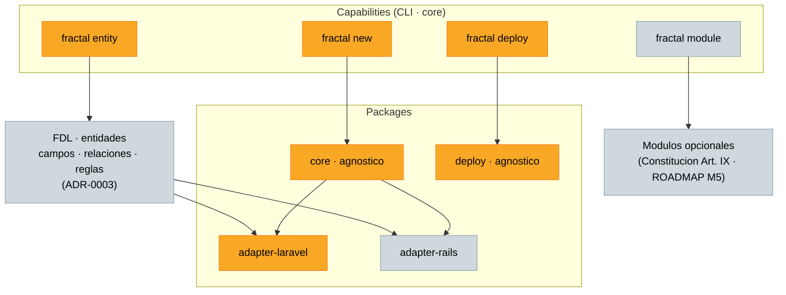

# Mapa de Progreso — Fractal

**Versión:** 1.0.0
**Estado:** Draft
**Última revisión:** 2026-09-28 — el Diagrama 1 (milestones) y el Diagrama 2
(capacidades y módulos) son ahora auto-generados desde
[`progress.json`](progress.json) (SPEC-0031).

---

Este documento es un **pantallazo visual del avance del proyecto**: un mapa para
ubicarse en el día a día y ver, de un vistazo, cómo va Fractal en su camino de
0 → producción. No reemplaza a la documentación de fondo — la complementa.

- La visión completa vive en [`VISION.md`](VISION.md).
- Los principios innegociables, en [`CONSTITUTION.md`](CONSTITUTION.md).
- **La fuente de verdad del estado es [`ROADMAP.md`](ROADMAP.md) + los
  milestones de Linear.** Este diagrama los *refleja*; se actualiza cuando un
  milestone cambia de estado. Si este mapa y ROADMAP discrepan, manda ROADMAP.

---

## Nota de convención

Este documento introduce diagramas **Mermaid** (se renderizan directamente en
GitHub). Es una convención nueva en el repo: hasta ahora los diagramas eran
ASCII (ver, por ejemplo, [`VISION.md`](VISION.md) §5 y
[`ARCHITECTURE_WORKFLOW.md`](ARCHITECTURE_WORKFLOW.md) §1). El cambio es
deliberado: Mermaid permite **colorear los nodos por estado**, que es
justamente lo que este mapa necesita.

---

## Leyenda de estados

- ✅ **Completado**
- 🟡 **En curso**
- ⬜ **Pendiente**

> ✅ y ⬜ son los mismos glifos que usa [`ROADMAP.md`](ROADMAP.md). 🟡 **en curso**
> es un estado intermedio que introduce este mapa, para reflejar trabajo ya
> arrancado que todavía no cumple su Definition of Done.

---

## Diagrama 1 — Avance por milestone (M0 → M6)

> **Generado automáticamente** desde [`progress.json`](progress.json) con
> `fractal status --write` (o el dev-tool `pnpm progress` /
> `scripts/progress-map.js`, un wrapper fino sobre el mismo núcleo). No editar a
> mano el bloque entre los marcadores: se sobrescribe. El **Diagrama 2**
> (capacidades y módulos) también se genera automáticamente desde
> [`progress.json`](progress.json) (SPEC-0031 AC-3).
>
> La CI del repo corre `fractal status --check` (modo dry-run, no escribe) y
> **bloquea el merge** si este bloque quedó desactualizado respecto de
> `progress.json`: regenerá con `fractal status --write` y commiteá el cambio
> (SPEC-0031 AC-4, FRA-45).

```mermaid
flowchart LR
    M0["M0 · Fundaciones<br/>reglas, docs y CI base"]
    M1["M1 · Esqueleto vertical<br/>new + deploy = app online"]
    M2["M2 · FDL y entidades<br/>CRUD generado y desplegable"]
    M3["M3 · Autenticación y autorización<br/>roles, OAuth, 2FA"]
    M4["M4 · Adapter Rails<br/>multi-target verificado"]
    M5["M5 · Módulos avanzados<br/>módulos instalables"]
    M6["M6 · Operación<br/>backups, monitoreo, upgrade"]

    M0 --> M1 --> M2 --> M3 --> M4 --> M5 --> M6

    classDef done fill:#2e7d32,color:#fff,stroke:#1b5e20;
    classDef curso fill:#f9a825,color:#000,stroke:#f57f17;
    classDef pend fill:#cfd8dc,color:#000,stroke:#90a4ae;

    class M0,M1,M2 curso;
    class M3,M4,M5,M6 pend;
```

<!-- progress-map:auto:start -->

<!-- progress-map:auto:end -->

**Lectura honesta del estado actual** (justificada desde
[`ROADMAP.md`](ROADMAP.md) y el trabajo reciente):

- **M0 🟡** — Fundaciones casi completas (ADRs, docs, lint de acoplamiento,
  monorepo ✅); falta el ítem **CI base** (lint, tests, matriz de versiones).
- **M1 🟡** — El deploy está mergeado (FRA-36 / FRA-37 / FRA-38), pero su DoD y
  el e2e en CI siguen pendientes; los specs continúan **Aprobados**, no
  Implementados.
- **M2 🟡** — SPEC-0006 (contrato del adapter) pasó a **Aprobado** y ya tiene
  tickets creados (FRA-39 a FRA-42); la generación todavía no arrancó.
- **M3–M6 ⬜** — Pendientes.

---

## Diagrama 2 — Mapa de capacidades y módulos

> **Generado automáticamente** desde [`progress.json`](progress.json) (bloque
> `capacidades`) con `fractal status --write` (o `pnpm progress` /
> `scripts/progress-map.js`, wrapper fino sobre el mismo núcleo). No editar a
> mano el bloque entre los marcadores: se sobrescribe.

<!-- progress-map:diagrama2:start -->

<!-- progress-map:diagrama2:end -->

Cómo leerlo:

- **`fractal new` y `fractal deploy` 🟡** — trabajo de M1 mergeado, DoD pendiente.
- **`fractal entity` 🟡** — el contrato del adapter (SPEC-0006) está aprobado, así
  que la capability cuenta como arrancada; la generación en sí sigue pendiente.
- **FDL / entidades ⬜** — el modelo intermedio (ADR-0003: entidades, campos,
  relaciones, reglas) está especificado, pero su parser/generación es M2 sin
  entregar.
- **`fractal module` y módulos ⬜** — módulos opcionales, planificados para M5
  (ver [`CONSTITUTION.md`](CONSTITUTION.md) Artículo IX).
- **`core` y `deploy` 🟡** — packages agnósticos en construcción; **adapter-laravel
  🟡** como target de referencia; **adapter-rails ⬜**, target de validación (M4).

---

## Tabla de trazabilidad

Milestone → specs → estado (glifos de [`ROADMAP.md`](ROADMAP.md)) → milestone de
Linear. **[`ROADMAP.md`](ROADMAP.md) sigue siendo la fuente de verdad**; esta
tabla solo lo espeja.

| Milestone | Specs / ítems | Estado (ROADMAP) | Milestone en Linear |
|---|---|---|---|
| M0 — Fundaciones | ADR-0002/0003/0004/0006/0007 ✅, lint de acoplamiento ✅, monorepo ✅, **CI base** ⬜ | 🟡 (falta CI base) | M0 — Fundaciones |
| M1 — Esqueleto vertical | SPEC-0001, SPEC-0002, SPEC-0003 | ⬜ (deploy mergeado; DoD/CI e2e pendiente) | M1 — Esqueleto vertical |
| M2 — FDL y generación de entidades | SPEC-0004 … SPEC-0013 (SPEC-0006 **Aprobado**) | ⬜ | M2 — FDL y generación de entidades |
| M3 — Autenticación y autorización | SPEC-0014, SPEC-0015, SPEC-0016 | ⬜ | M3 — Autenticación y autorización |
| M4 — Adapter Rails | SPEC-0017 … SPEC-0021 | ⬜ | M4 — Adapter Rails |
| M5 — Módulos avanzados | SPEC-0022 … SPEC-0026 | ⬜ | M5 — Módulos avanzados |
| M6 — Operación | SPEC-0027 … SPEC-0030 | ⬜ | M6 — Operación |

> Recordatorio: un spec **Aprobado** no es un spec **Implementado**. Mientras
> ROADMAP marque ⬜, el estado real es pendiente aunque este mapa muestre 🟡 a
> nivel de milestone por trabajo ya arrancado.

---

## Roadmap de este documento (siguiente iteración)

Esta es una **primera versión**, pensada para robustecerse:

- Más detalle por etapa: sub-nodos por spec dentro de cada milestone.
- Entidades y módulos concretos a medida que se definan por spec (hoy el mapa
  trabaja a nivel de capability y concepto).
- Posible **generación automática** del diagrama desde ROADMAP.md y/o los
  milestones de Linear, para que el mapa deje de actualizarse a mano y no pueda
  quedar desincronizado de la fuente de verdad.
